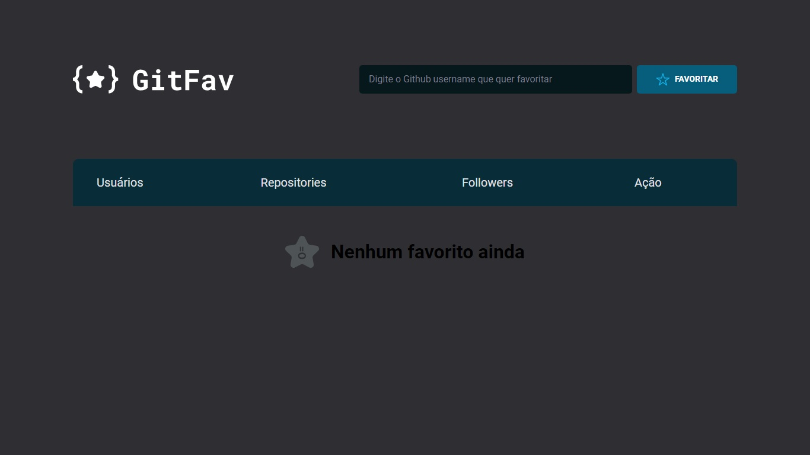

# Desafio GitFav

Desafio do Stage06 que faz parte do Programa Explorer da Rocketseat  

A ideia agora é criar o GitFav!  

## Screenshots

[🔗 Clique aqui para acessar o Projeto](https://fabiovascao.github.io/Desafio-GitFav/)  
[🔗 Clique aqui para acessar o Figma](https://www.figma.com/file/xcRHzoVZE845XLcuyNwRTP/Desafios-Explorer-GitFav-Copy-Copy?fuid=1151137169943796805)  

## 🛠 Tecnologias

- HTML
- CSS
- Git e Github
- JavaScript

## Autor

- [@FabioVascão](https://www.github.com/fabiovascao)